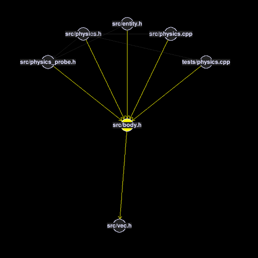
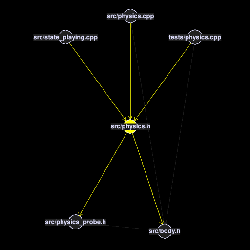
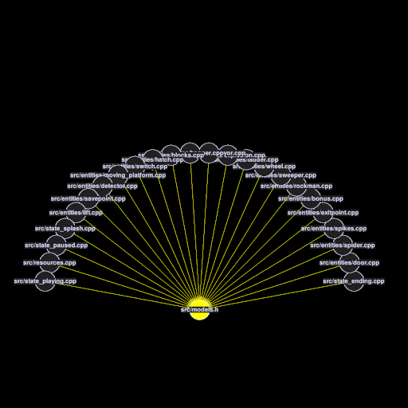
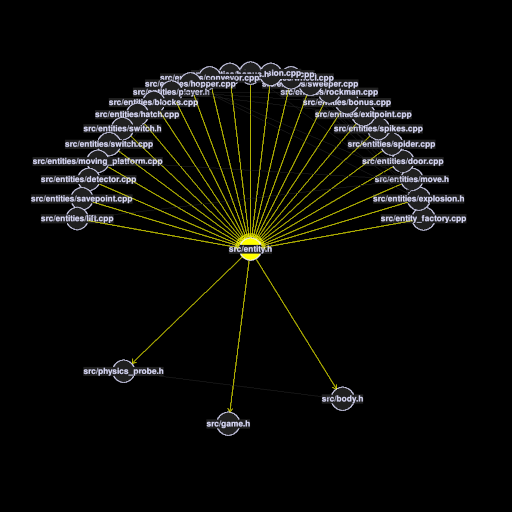

# graphmaze

A first-person tool for exploring large graphs.

## Usage example

```
$ ./graphmaze data/horrible.dot
```

## Screenshots

<table><tbody>
<tr>
<th>  </th>
<th>  </th>
</tr>
<tr>
<th>  </th>
<th>  </th>
</tr>
</tbody></table>

